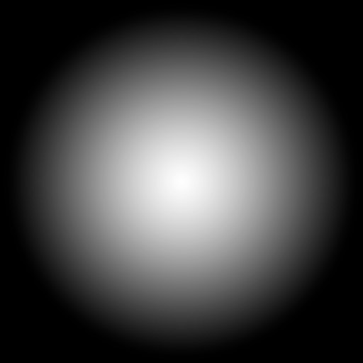

### Three.js Lecture - 16 : Lights

# Basics

- Now that we have lights, we want shadows
- The dark shadow in the back of the objects are called core shadows
- what we are missing is the drop shadow.
- Shadows have always been a challenge for real time 3d rendering, and developers must find tricks to display realistic shadows at a reasonable framerate
- Three.js has an inbuilt solution
- it's not perfect but it's convenient

## How It Works?

- When you do one render, three.js will do a render for each light supporting shadows.
- Those renders will simulate what the light sees as if it was a camera
- During these lights renders, a MeshDepthMaterial replaces all the materials
- The lgiht renders are stored as textures and we call that shadow maps
- They are then used on every materials supposed to receive shadows and projected on the geometry

## How to use?

- Activate the shadowMap on renderer.
- Syntax:
  ```js
  renderer.shadowMap.enabled = true;
  ```
- Go throught each object and decide if it can cast a shadow with castShadow and if it can receive shadow with receiveShadow.
- Syntax:
  ```js
  sphere.castShadow = true;
  // after declaring plane
  plane.receiveShadow = true;
  ```
- Only the following types of lights support shadows.
  - PointLight
  - DirectionalLight
  - SpotLight
- By default the shadow map size is 512 \* 512
- We can imporve it but keep it in the power of 2 for the mipmapping
- Syntax :
  ```js
  directionalLight.shadow.mapSize.width = 1024 * 2;
  directionalLight.shadow.mapSize.height = 1024 * 2;
  ```
- If we want to optimize our camera, then we will set the near and far value as optimized as possible.
- Iw we want to see the near and far points, then we will simply use directional light helper and will add into scene.
- Syntax :
  ```js
  const directionalLightCameraHelper = new THREE.CameraHelper(
    directionalLight.shadow.camera
  );
  ```
- And if you want to change the near and far value, then you can do that by using the below syntax.
- Syntax :
  ```js
  directionalLight.shadow.camera.near = 2;
  directionalLight.shadow.camera.far = 6;
  ```
- With the help of Camera Helper we can see that the amplitude is too much large.
- Because we are using a Directional Light, Three.js is using an OrthographicCamera
- We can control how far on the each side the camera can see with top, right, left, bottom.
- Syntax :
  ```js
  directionalLight.shadow.camera.top = 2;
  directionalLight.shadow.camera.left = -2;
  directionalLight.shadow.camera.right = 2;
  directionalLight.shadow.camera.bottom = -2;
  ```
- The smaller the values are, the more precise the shadow will be.
- If it's too small then the shadow will be cropped.
- Once we have set all the values, we can hide the camera helper by using visible property also as below.
  ```js
  directionalLightCameraHelper.visible = false;
  ```

## Blur

- We can control the shadow blur with the radius property
  ```js
  directionalLight.shadow.radius = 30;
  ```
- This technic doesn't use the proximity of the camera with the object, it's a general and cheap blur

## Shadow Map Algorithm

- Different types of algorithms can be applied to shadow maps
  - THREE.BasicShadowMap = very performant but loosy quality
  - THREE.PCFShadowMap = Less performant but smoother edges (default)
  - THREE.PCFSoftShadowMap = Less performant but even softer edges
  - THREE.VSMShadowMap = Less performant, more constraints, can have unexpected results.
- For updating the shadowMap, we will use this syntax
  ```js
  renderer.shadowMap.type = THREE.PCFSoftShadowMap;
  ```

### SpotLight

- Because we are using SpotLight, Three.js will use perspective camera
- We must change the fov property to adapt the amplitude.

  ```js
  const spotlight = new THREE.SpotLight("white", 0.4, 10, Math.PI * 0.3);
  spotlight.castShadow = true;
  spotlight.position.set(0, 2, 2);
  spotlight.shadow.mapSize.height = 1024;
  spotlight.shadow.mapSize.width = 1024;

  spotlight.shadow.camera.near = 2;
  spotlight.shadow.camera.far = 6;
  spotlight.shadow.camera.fov = 30;
  scene.add(spotlight);

  const spotlightCameraHelper = new THREE.CameraHelper(spotlight.shadow.camera);
  spotlightCameraHelper.visible = false;
  scene.add(spotlightCameraHelper);
  ```

### PointLight

    ```js
    const pointLight = new THREE.PointLight("white", 10);
    pointLight.castShadow = true;
    pointLight.position.set(-2, 2, 0);
    scene.add(pointLight);

    const pointLightCameraHelper = new THREE.CameraHelper(pointLight.shadow.camera);
    scene.add(pointLightCameraHelper);
    ```

- The camera helper seems to be PerspectiveCamera facing downward
- Three.js uses a PerspectiveCamera but in all 6 directions and finishes downward

### Baking Shadows

- A good alternative to Three.js shadows is baked shadows
- We integrate shadows in textures that we can apply on materials
- In simple language, we will create one plane which will contain the texture of a shadow
- and will simply add that plane below the object
- buthere the problem is that we have to modify the position of plane accrding to object
- this is also known as static shadow
- the alternative for this is simple shadow.
- in simple shadow also we will load the shadow into structure, but here the shadow image will be different.
- the shadow image will be circle (white circle) and outside it, will see the black.
- the white part is called visible shadow and the black part is called invisible shadow
- here we have the image of the shadow(simple shadow), and will use that in our code
  

